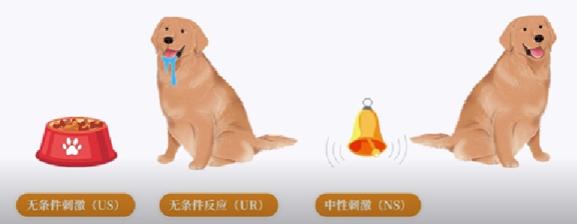
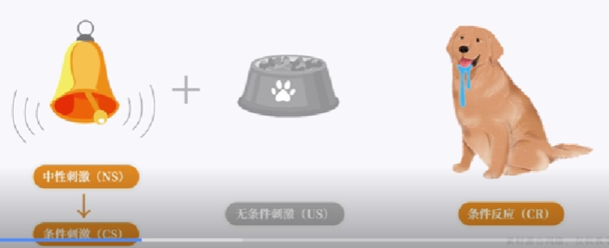

行为学习是指通过观察和模仿他人行为来获得新技能和知识的过程。这种学习方式强调环境和社会因素对个人行为的影响，认为个体可以通过观察他人的行为及其结果，形成对特定行为的理解并进行模仿。行为学习在教育、心理学和日常生活中都有广泛的应用，能够帮助人们更有效地适应环境，掌握新技能，并促进行为改变。通过研究行为学习，我们可以更好地理解学习机制，提高教学方法和个人发展策略。

> **关键内容**
>
> ---
>
> **经典性条件作用，消退，泛化，分化，高级条件作用，第一信号系统，第二信号系统**
>
> **操作性条件作用，强化，强化物，普雷马克原理，惩罚，强化程序，塑造**
>
> 社会学习理论，交互决定论，观察学习，直接强化，替代强化，自我强化

<!-- more -->

## 学习与学习理论

### 学习的界定

学习是指由于**经验**而导致的**行为或行为潜能**的**相对持久的变化**。

1. 学习导致某种变化：可能表现在可以观察到、可以测量的外显行为上

    - 行为变化：可能是学习者表现出新的行为
    - 学习者改变了已有行为
        - 行为频率
        - 行为速度
        - 行为强度
        - 行为的复杂性
        - 行为倾向

2. 关于行为潜能的概念

    - 学习导致的变化有时并没有立刻表现在行为上，而是在一段时间后或者在一定的情境下才表现在行为上，这种变化是一种行为潜能的变化（记忆、四为、态度、价值观等）

    - 行为潜能意味着存在表现出行为的可能性，但不一定会表现出来
    - 学习与表现不能等同

3. 学习导致的变化是由于**个体的经验**所引起的

    - 这种经验过程可以使学习者接收刺激、亲自参与某件事情、进行反复的练习、观察其他个体的活动、阅读或听讲等
    - 并非所有的变化都是由学习导致的（导致行为变化的其他原因）：
        - 本能
        - 遗传
        - 成熟（青春期有关性的心理和行为发生了变化）
        - 疲劳
        - 适应
        - 脑创伤
        - 药物

4. 学习是一个广义的概念，不仅是人类普遍具有的，动物也存在学习（马戏团）

    人类的学习是积极主动地、社会性的、以符号为中介的，与动物学习具有本质上的区别

### 学习理论

对学习的解释，涉及学习的实质、过程、条件和规律。

### 学习理论流派

- 行为主义
- 认知主义
- 建构主义
- 人本主义

## 经典性条件作用

> 巴普洛夫的经典性条件作用

经典条件作用——主要解释情绪情感及多种生理反应的不随意学习。

严格定义：中性刺激因与无条件刺激或条件刺激配对而获得<u>诱发应答性反应的力量</u>的过程。

### 普遍性

- 多种生理反应与情绪情感反应均可作为条件反应
- 多种刺激（视觉、嗅觉、视觉、味觉等）可称为诱发条件反应的条件刺激

### 相关规律概念

第一信号系统：诱发条件反应的具体实物。

第二信号系统：诱发条件反应的抽象符号。

> 耐药性分析
> 
> ---
> 
> 药物的实际效果=药物理论效果-条件反应的补偿作用

消退：条件刺激或无条件刺激反复单独出现后，条件反应逐渐减弱，直至消失的过程。

自发恢复：已消失的条件反应再次出现。

> 焦虑症/恐惧症
>
> ---
>
> 某种中性刺激与让人可怕或焦虑的事件建立了联系，从而成为了可诱发恐惧或焦虑的条件刺激。

泛化：相似刺激诱发相似反应，如创伤性事件、PTSD等。

分化：仅条件刺激可诱发反应，而对与条件刺激相似的其他刺激不予反应。（区分不同刺激并作出不同反应）

> 过度的分化或一味的分化也不具适应性，易导致个体难以灵活地迁移已有经验，并耗费不必要的心理资源。

高级条件作用：中性刺激通过与条件刺激配对而建立新的条件作用的过程。

## 操作性条件作用

### 教授新行为

行为学习理论认为，结果的及时呈现非常重要。（小型但及时强化物 > 大型但延迟强化物）

迷信——行为与不相关结果（反应与强化物）在发生时间上的接近性让人产生因果相倚感，例如守株待兔。

延迟折扣：强化物的主观价值随延迟呈现时间的增多而减少。

因此应当及时给予学习者积极反馈，以增强新行为和结果之间的因果相倚感，也能凸显反馈或学习本身的价值。

**塑造**：是一种强化趋近预期目标行为的进步行为的连续接近技术，有助于防止此类问题，提供即时强化。（涉及单一的行为强化）

**连锁**：先学习和强化单一反应，再逐步加入新反应以同时学习和强化。

- 顺向连锁：先学习复杂行为的第一个反应，后将后续反应逐个纳入并同时强化的过程。
- 逆向连锁：先学习复杂行为的最后一个反应，后将之前的反应诸葛纳入并同时强化的过程。（教授特殊儿童脱袜子）

因而恰当的任务分析以及后续的任务分解十分关键。

## 社会学习理论

