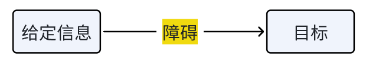

<!-- more -->

## 问题解决

首先，何谓问题？

接下来需要对问题进行分类：

1. 界定问题：清晰 | 模糊
2. 对抗性 | 非对抗
3. 语意丰富 | 语义贫乏：前者-数学家解决几何方面的问题；后者-新手下象棋

### “问题解决”的概念

一系列有目标指向性的认知过程。

整个过程：发现目标、选择问题解决策略、评估问题解决方案、重新思考和定义问题，解决问题。

- 目标的指向性
- 操作的系列性
- 操作的认知性：思维认知成分的参与+情绪 | 动机 | 行为 ……

### 问题解决的策略

1. 机械式：算法策略（暴力枚举）
2. 启发式：
    1. 手段-目的分析：初始状态-中间状态-目标状态。特别地，可能会暂时扩大初始状态和目标状态的差距来解决问题
    2. 爬山法：与上面类似
    3. 逆向搜索目标状态-中间状态-初始状态
3. 顿悟式

### 问题解决的影响因素

1. 已有知识在问题解决中的作用：已有知识是经验的集合，是问题解决的重要基础
2. 无关信息的影响：克服认知资源的局限性
3. 知识表征的方式：例如数形结合
4. 思维定势和功能固着
5. 锚定效应和酝酿效应
    - 锚定效应：问题最初信息会影响个体对后面信息的加工，在做决策的时候个体会不自觉地给予最初获得的信息过多的重视
    - 酝酿效应：暂时搁置回头再看

## 创造性思维

创造性思维是根据一定的目的，运用已知的信息，产出某种新颖的、独特的、有社会价值的产品的思维过程。

- 流畅性：在特定问题情境下，个体单位时间内想出**不同**答案（同一类型或同一领域）的数量。
- 灵活性：面对一个问题时，**克服已有的思维框架和定势**，按照某种新视角、新观念或新途径，想出**不同类型**答案的数量。
- 独创性：产生不寻常的和不落常规的解决问题的方法和能力。

### 培养创造性思维

1. 培养创造性认知能力：思维以**大量信息**为前提，掌握创造性思维的**知识**是发展学生创造性思维的前提。
2. 注重创造性个性的塑造：勇于面对风险、具有较高的内部动机、思维灵活有趣，且能较客观的评价自我。
3. 创设有利的学习环境

## 批判性思维

主动性、广泛性、开放性、创新性

### 培养批判性思维

1. 多角度思考问题
2. 提出有意义的问题
3. 鼓励学生进行推理
4. 带领学生自我反思
5. 促进学生互相协作

## 学习迁移

