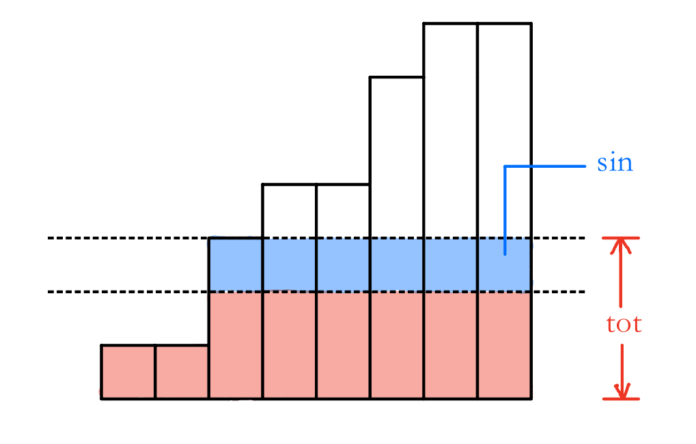

原题链接：[牛客周赛 Round 46 E-立希喂猫](https://ac.nowcoder.com/acm/contest/84444/E)

## 题意

有 $n$ 种物品，其价值与数目分别对应为 $a_i, b_i$ 。每次最多可以从每种物品中取出一个。现有 $q$ 次询问 $k_i$ ，表示第 $k_i$ 次累计取出的物品数量的最大值是多少。

### 数据范围

> $1\leq n \leq 10^5$ 
>
> $1\leq a_i \leq 10^4$ ， $1\leq b_i \leq 10^9$​ 
>
> $1\leq q \leq 10^5$​， $1\leq k \leq 10^9$ 

### 样例

#### 输入

```markdown
3
3 7 5
1 2 1
3
1
2
3
```

#### 输出

```markdown
15
22
22
```

## 题解

关键因素 $b_i$ 反映了对应物品的“寿命”，因此可以将数组 $\left\{b\right\}$ 进行非降序排序：



使用结构体数组 $\{pre\}$ 离散地记录图中每个 $b$ 对应的天数 $day$ ，同时记录该天对应的 $sin$ 和总物品数量 $tot$。

询问时特判 $k\leq pre[1].day$ 和 $k\geq pre[-1].day$ ，其余使用二分即可计算答案。

```c++
#include <bits/stdc++.h>
using namespace std;
typedef long long ll;
const int N = 1e5 + 5;

int n, q;
ll a[N];
struct node {
    int id = 0, cnt = 0;
    bool operator < (const node& other) const {
        return cnt < other.cnt;
    }
} b[N];
struct node1 {
    ll sin = 0;
    ll tot = 0;
    int day = 0;
} pre[N];
ll ans[N];

int main() {
    ios::sync_with_stdio(0);
    cin.tie(0); cout.tie(0);
    cin >> n;
    ll sum = 0;
    for (int i = 1;i <= n;i++) cin >> a[i], sum += a[i];
    for (int i = 1;i <= n;i++) cin >> b[i].cnt, b[i].id = i;
    sort(b + 1, b + n + 1);
    int cnt = 0;
    for (int i = 1;i <= n;i++) {
        while (b[i].cnt == b[i - 1].cnt) sum -= a[b[i++].id];
        if (i > n) break;
        pre[++cnt].day = b[i].cnt;
        pre[cnt].sin = sum;
        pre[cnt].tot = pre[cnt - 1].tot + 1LL * (b[i].cnt - b[i - 1].cnt) * sum;
        sum -= a[b[i].id];
    }
    cin >> q;
    int qq = q;
    int t = 0;
    while (q--) {
        t++;
        int k; cin >> k;
        if (k <= pre[1].day) { ans[t] = pre[1].sin * k; continue; }
        if (k >= pre[cnt].day) { ans[t] = pre[cnt].tot; continue; }
        int l = 1, r = cnt;
        while (l < r) {
            int m = (l + r + 1) >> 1;
            if (pre[m].day > k) r = m - 1;
            else l = m;
        }
        ans[t] = pre[l].tot + 1LL * (k - pre[l].day) * pre[l + 1].sin;
    }
    for (int i = 1;i <= qq;i++) cout << ans[i] << '\n';
    return 0;
}
```

