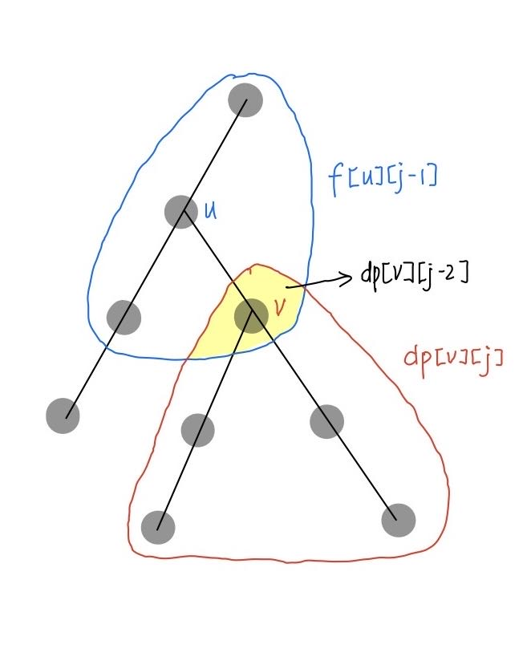

原题链接：[P3047 [USACO12FEB] Nearby Cows G](https://www.luogu.com.cn/problem/P3047) 

## 题目描述

给你一棵 $n$ 个点的树，点带权，对于每个节点求出距离它不超过 $k$ 的所有节点权值和 $m_i$。

## 输入格式

第一行两个正整数 $n,k$。
接下来 $n-1$ 行，每行两个正整数 $u,v$，表示 $u,v$ 之间有一条边。
最后 $n$ 行，每行一个非负整数 $c_i$，表示点权。

## 输出格式

输出 $n$ 行，第 $i$ 行一个整数表示 $m_i$。

## 样例 #1

### 样例输入 #1

```
6 2 
5 1 
3 6 
2 4 
2 1 
3 2 
1 
2 
3 
4 
5 
6
```

### 样例输出 #1

```
15 
21 
16 
10 
8 
11
```

## 提示

There are 6 fields, with trails connecting (5,1), (3,6), (2,4), (2,1), and (3,2).  Field i has C(i) = i cows.


Field 1 has M(1) = 15 cows within a distance of 2 trails, etc.

【数据范围】
对于 $100\%$ 的数据：$1 \le n \le 10^5$，$1 \le k \le 20$，$0 \le c_i \le 1000$

---

## 题解

首先可以通过 $dfs$ 得到节点 $u$ 向下恰好 $j$ 步的点的权值和，以此求出距离节点 $u$ 恰好 $j$ 步的所有点的点权和，记前者为 $dp[u][j]$ ，后者为 $f[u][j]$ 。



由图可得
$$
f[v][j] = f[u][j] + dp[v][j] - dp[v][j-2]
$$
最后将 $1\sim k$ 的 $f[u][j]$ 累加即可。

## 代码

```c++
#include <bits/stdc++.h>
using namespace std;
const int N = 1e5 + 5;

int n, k;
vector<int> G[N];
int c[N];

int dp[N][25];
int f[N][25];

void dfs1(int u, int fa) {
    for (int v : G[u]) {
        if (v == fa) continue;
        dfs1(v, u);
        for (int j = 1;j <= k;j++) {
            dp[u][j] += dp[v][j - 1];
        }
    }
}

void dfs2(int u, int fa) {
    for (int v : G[u]) {
        if (v == fa) continue;
        for (int j = 1;j <= k;j++) {
            f[v][j] = f[u][j - 1] + dp[v][j];
            f[v][j] -= (j == 1 ? 0 : dp[v][j - 2]);
        }
        dfs2(v, u);
    }
}

int main() {
    cin >> n >> k;
    for (int i = 1;i < n;i++) {
        int u, v; cin >> u >> v;
        G[u].push_back(v); 
        G[v].push_back(u); 
    }
    for (int i = 1;i <= n;i++) { cin >> c[i]; dp[i][0] = c[i]; }
    dfs1(1, 1);
    for (int j = 1;j <= k;j++) f[1][j] = dp[1][j];
    for (int i = 1;i <= n;i++) f[i][0] = c[i];
    dfs2(1, 1);
    for (int i = 1;i <= n;i++) {
        int ans = 0;
        for (int j = 0;j <= k;j++) {
            ans += f[i][j];
        }
        cout << ans << '\n';
    }
    return 0;
}
```

