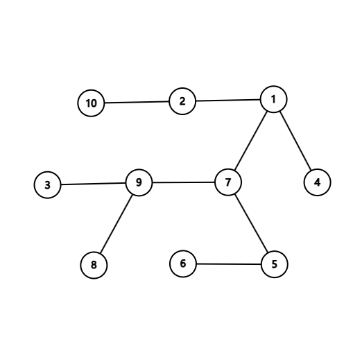

原题链接：[P4395 [BOI2003] Gem 气垫车](https://www.luogu.com.cn/problem/P4395) 

## 题目描述

给出一棵树，要求你为树上的结点标上权值，权值可以是任意的正整数 

唯一的限制条件是相邻的两个结点不能标上相同的权值，要求一种方案，使得整棵树的总价值最小。

## 输入格式

先给出一个数字 $N$ ，代表树上有 $N$ 个点， $N<=10000$ 。

下面 $N-1$ 行，代表两个点相连。

## 输出格式

最小的总权值。

## 样例 #1

### 样例输入 #1

```
10 
7 5 
1 2 
1 7 
8 9 
4 1 
9 7 
5 6 
10 2 
9 3
```

### 样例输出 #1

```
14
```



## 提示

本题已经添加数据，但考虑到题目年代较为久远（毕竟是2003年的BOI了）以及洛谷神速评测姬，将此题时限修改为500ms。

---

## 题解

这题并不是双颜色染色问题那么简单，不妨考虑如下结构：

​	$Tree:\ 一个节点(点权为\ 2)有三个子节点(点权都为\ 1)$

若交换父亲与儿子的点权，则增量为 $2$ ： $(1+2+2+2)-(2+1+1+1)=2$ ；

考虑父亲的父亲的变化（考虑父亲有多个这样的子树限制）：$3\Rightarrow 2$ ，增量为 $-1$ ；

上述总的增量为正，其他子树同理可以变换，因此最大值的最小值随着 $n$ 的变化而变化，大致为 $m=log2(n)$ （未证明）。

于是问题转变为了多颜色染色问题，颜色总数不超过 $m$ 。

## 代码

<iframe   src="https://carbon.now.sh/embed?bg=rgba%28171%2C+184%2C+195%2C+1%29&t=twilight&wt=none&l=text%2Fx-c%2B%2Bsrc&width=785.5&ds=true&dsyoff=20px&dsblur=68px&wc=true&wa=false&pv=56px&ph=56px&ln=false&fl=1&fm=Hack&fs=14px&lh=133%25&si=false&es=2x&wm=false&code=%2523include%2520%253Cbits%252Fstdc%252B%252B.h%253E%250Ausing%2520namespace%2520std%253B%250Aconst%2520int%2520N%2520%253D%25201e4%2520%252B%25205%253B%250Atypedef%2520long%2520long%2520ll%253B%250Aconst%2520int%2520INF%2520%253D%25200x3fffffff%253B%250A%250Aint%2520n%252C%2520m%253B%250Avector%253Cint%253E%2520G%255BN%255D%253B%250Aint%2520f%255BN%255D%255B20%255D%253B%250A%250Avoid%2520dfs%28int%2520u%252C%2520int%2520fa%29%2520%257B%250A%2520%2520%2520%2520for%2520%28int%2520i%2520%253D%25201%253Bi%2520%253C%253D%2520m%253Bi%252B%252B%29%2520f%255Bu%255D%255Bi%255D%2520%253D%2520i%253B%250A%2520%2520%2520%2520for%2520%28int%2520v%2520%253A%2520G%255Bu%255D%29%2520%257B%250A%2520%2520%2520%2520%2520%2520%2520%2520if%2520%28v%2520%253D%253D%2520fa%29%2520continue%253B%250A%2520%2520%2520%2520%2520%2520%2520%2520dfs%28v%252C%2520u%29%253B%250A%2520%2520%2520%2520%2520%2520%2520%2520for%2520%28int%2520i%2520%253D%25201%253Bi%2520%253C%253D%2520m%253Bi%252B%252B%29%2520%257B%250A%2520%2520%2520%2520%2520%2520%2520%2520%2520%2520%2520%2520int%2520tmp%2520%253D%2520INF%253B%250A%2520%2520%2520%2520%2520%2520%2520%2520%2520%2520%2520%2520for%2520%28int%2520j%2520%253D%25201%253Bj%2520%253C%253D%2520m%253Bj%252B%252B%29%2520%257B%250A%2520%2520%2520%2520%2520%2520%2520%2520%2520%2520%2520%2520%2520%2520%2520%2520if%2520%28i%2520%21%253D%2520j%29%2520tmp%2520%253D%2520min%28tmp%252C%2520f%255Bv%255D%255Bj%255D%29%253B%250A%2520%2520%2520%2520%2520%2520%2520%2520%2520%2520%2520%2520%257D%250A%2520%2520%2520%2520%2520%2520%2520%2520%2520%2520%2520%2520f%255Bu%255D%255Bi%255D%2520%252B%253D%2520tmp%253B%250A%2520%2520%2520%2520%2520%2520%2520%2520%257D%250A%2520%2520%2520%2520%257D%250A%257D%250A%250A%250Aint%2520main%28%29%2520%257B%250A%2520%2520%2520%2520ios%253A%253Async_with_stdio%280%29%253B%2520cin.tie%280%29%253B%250A%2520%2520%2520%2520cin%2520%253E%253E%2520n%253B%250A%2520%2520%2520%2520for%2520%28int%2520i%2520%253D%25201%253Bi%2520%253C%2520n%253Bi%252B%252B%29%2520%257B%250A%2520%2520%2520%2520%2520%2520%2520%2520int%2520u%252C%2520v%253B%2520cin%2520%253E%253E%2520u%2520%253E%253E%2520v%253B%250A%2520%2520%2520%2520%2520%2520%2520%2520G%255Bu%255D.push_back%28v%29%253B%250A%2520%2520%2520%2520%2520%2520%2520%2520G%255Bv%255D.push_back%28u%29%253B%250A%2520%2520%2520%2520%257D%250A%2520%2520%2520%2520m%2520%253D%2520log2%28n%29%2520%252B%25201%253B%250A%2520%2520%2520%2520dfs%281%252C%25201%29%253B%250A%2520%2520%2520%2520int%2520res%2520%253D%2520INF%253B%250A%2520%2520%2520%2520for%2520%28int%2520i%2520%253D%25201%253Bi%2520%253C%253D%2520m%253Bi%252B%252B%29%2520%257B%250A%2520%2520%2520%2520%2520%2520%2520%2520res%2520%253D%2520min%28f%255B1%255D%255Bi%255D%252C%2520res%29%253B%250A%2520%2520%2520%2520%257D%250A%2520%2520%2520%2520cout%2520%253C%253C%2520res%2520%253C%253C%2520%27%255Cn%27%253B%250A%2520%2520%2520%2520return%25200%253B%250A%257D"   style="width: 786px; height: 971px; border:0; transform: scale(1); overflow:hidden;"   sandbox="allow-scripts allow-same-origin"> </iframe>

